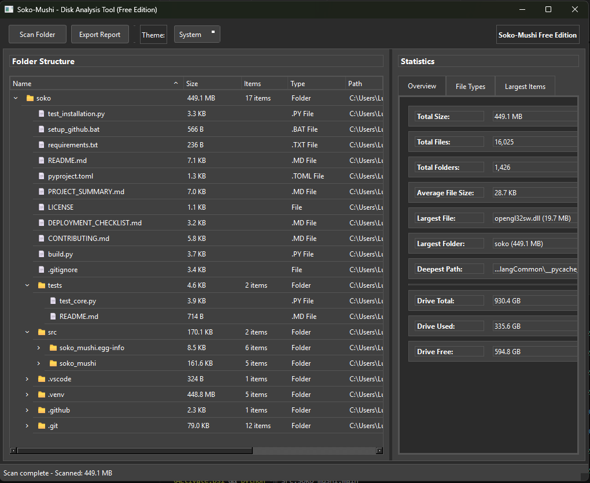

# Soko-Mushi - Local Disk Analysis Tool (Free Edition)

[](https://coff.ee/seijaku)

A powerful, cross-platform disk analysis tool with a modern TreeSize-style interface. Analyze your local storage, identify space-hungry files and folders, and export detailed reports.




## ✨ Features

### ✅ Included in Free Edition
- **Local disk analysis** - Scan any folder or drive on your system
- **Visual tree view** - Hierarchical folder structure with sizes
- **Top largest files/folders** - Quick identification of space consumers
- **File type breakdown** - Group and analyze files by extensions
- **Export reports** - JSON and CSV formats for further analysis
- **Modern Qt interface** - Professional, native-looking GUI (now using PySide6)
- **Cross-platform** - Windows, Mac, and Linux support
- **No registration** - Download and run immediately


## � Support the Project

If you find Soko-Mushi useful, please consider supporting its development:

[](https://coff.ee/seijaku)

Your support helps keep this project alive and enables new features!

## �🚀 Quick Start

### Option 1: Download Pre-built Executable
1. Go to [Releases](https://github.com/seijaku-code/soko-mushi/releases)
2. Download the executable for your platform
3. Run the application directly (no installation required)

## ⚠️ macOS Gatekeeper & Unsigned App Note

Soko-Mushi is a free and open source tool. Apple requires a paid Developer ID to sign and notarize macOS apps. This means the app is unsigned, and you may see a warning like "Soko-Mushi.app is damaged and can't be opened" or "cannot be opened because it is from an unidentified developer."

To run the app:

1. Open Terminal.
2. Run the following command (replace the path if needed):
   ```sh
   xattr -dr com.apple.quarantine /Applications/Soko-Mushi.app
   ```
3. You can now open the app normally.

Alternatively, right-click the app and choose "Open" to bypass the warning for unsigned apps.

This is a standard macOS security feature for all unsigned apps. Paid signing is not feasible for all open source projects, but the app is safe and open source.

### Option 2: Run from Source
```bash
# Clone the repository
git clone https://github.com/seijaku-code/soko-mushi.git
cd soko-mushi

# Install dependencies
pip install -r requirements.txt

# Run the application
python src/soko_mushi/main.py
```

## 🔧 Building from Source

### Prerequisites
- Python 3.8 or higher
- pip package manager

### Development Setup
```bash
# Clone and setup
git clone https://github.com/seijaku-code/soko-mushi.git
cd soko-mushi

# Create virtual environment (recommended)
python -m venv venv
source venv/bin/activate  # On Windows: venv\\Scripts\\activate

# Install dependencies
pip install -r requirements.txt

# Install development dependencies
pip install -e .[dev]
```

### Running the Application
```bash
# From project root
python src/soko_mushi/main.py

# Or using the installed script
soko-mushi
```

### Building Executable
```bash
# Install Nuitka
pip install nuitka

# Build executable (cross-platform)
cd src
python build.py

# The executable or app bundle will be in the 'dist' directory
```

### Platform-Specific Build Details

#### Windows
- Produces a standalone `.exe` with icon and metadata.
- No installation required.

#### macOS
- Produces a `.app` bundle with correct icon and Info.plist.
- To create a DMG for distribution, use:
  ```bash
  npm install -g create-dmg
  create-dmg dist/main.app
  # or if renamed: create-dmg dist/soko-mushi.app
  ```

#### Linux
- Produces a standalone binary. Ensure execute permissions with `chmod +x` if needed.

## 📊 Usage

### Basic Workflow
1. **Launch** Soko-Mushi
2. **Click "Scan Folder"** and select a directory to analyze
3. **Explore** the tree view to see folder hierarchy and sizes
4. **Review statistics** in the right panel
5. **Export reports** for further analysis

### Interface Overview

#### Tree View (Left Panel)
- **Hierarchical display** of folders and files
- **Size information** for each item
- **File/folder icons** for easy identification
- **Expandable/collapsible** structure
- **Right-click context menu** with additional options

#### Statistics Panel (Right Panel)
- **Overview tab** - Total size, file counts, largest items
- **File Types tab** - Breakdown by file extensions
- **Largest Items tab** - Top space consumers

#### Toolbar
- **Scan Folder** - Start new analysis
- **Export Report** - Save results to file
- **Theme Selector** - Switch between Light/Dark/System themes

### Export Formats

#### JSON Export
Complete scan results with full hierarchy:
```json
{
  "scan_timestamp": "2025-01-21T10:30:00",
  "root_path": "/path/to/scanned/folder",
  "total_size": 1234567890,
  "file_tree": { ... },
  "file_type_stats": { ... },
  "largest_items": [ ... ]
}
```

#### CSV Exports
- **File List** - Complete file inventory
- **File Types Statistics** - Extension breakdown
- **Largest Items** - Top space consumers

## 🎨 Themes

Soko-Mushi supports multiple visual themes:
- **System** - Follows your OS theme
- **Light** - Clean, bright interface
- **Dark** - Easy on the eyes for extended use

## 🔒 Privacy & Security

- **100% Local** - No data leaves your computer
- **No tracking** - No analytics or telemetry
- **No internet required** - Works completely offline
- **Open source** - Audit the code yourself

## 🐛 Troubleshooting

### Common Issues

#### "Permission Denied" Errors
- Run as administrator (Windows) or with sudo (macOS/Linux)
- Ensure you have read permissions for the target directory

#### Large Directory Scans Are Slow
- This is normal for directories with millions of files
- Use the "Stop Scan" button if needed
- Consider scanning subdirectories individually

#### GUI Appears Blank or Corrupted
- Update your graphics drivers
- Try different themes (System/Light/Dark)
- Ensure you have PySide6 properly installed: `pip install PySide6`
- On Linux, install Qt6 system packages if needed

#### Executable Won't Start
- Check that all dependencies are included in the build
- On Linux, ensure execute permissions: `chmod +x soko-mushi`

### Performance Tips
- **Close unnecessary programs** before large scans
- **Scan specific subdirectories** rather than entire drives
- **Use SSD storage** for better I/O performance

## 🤝 Contributing

We welcome contributions! See [CONTRIBUTING.md](CONTRIBUTING.md) for guidelines.

### Development
```bash
# Run tests
pytest

# Code formatting
black src/

# Type checking
mypy src/
```

## 📄 License

This project is licensed under the MIT License - see the [LICENSE](LICENSE) file for details.

##  Acknowledgments

- Built with [PySide6](https://wiki.qt.io/Qt_for_Python) for modern GUI
- Compiled with [Nuitka](https://nuitka.net/) for performance
- Inspired by [TreeSize](https://www.jam-software.com/treesize) and similar tools

## 📈 System Requirements

### Minimum Requirements
- **OS**: Windows 10, macOS 10.14, or Linux with GUI
- **RAM**: 512 MB
- **Storage**: 50 MB free space
- **Python**: 3.8+ (for source installs)

### Recommended
- **RAM**: 2 GB or more for large directory scans
- **Storage**: SSD for better performance
- **Display**: 1024x768 or higher resolution

---

**Soko-Mushi** - Making disk analysis simple and powerful! 🐛📊
